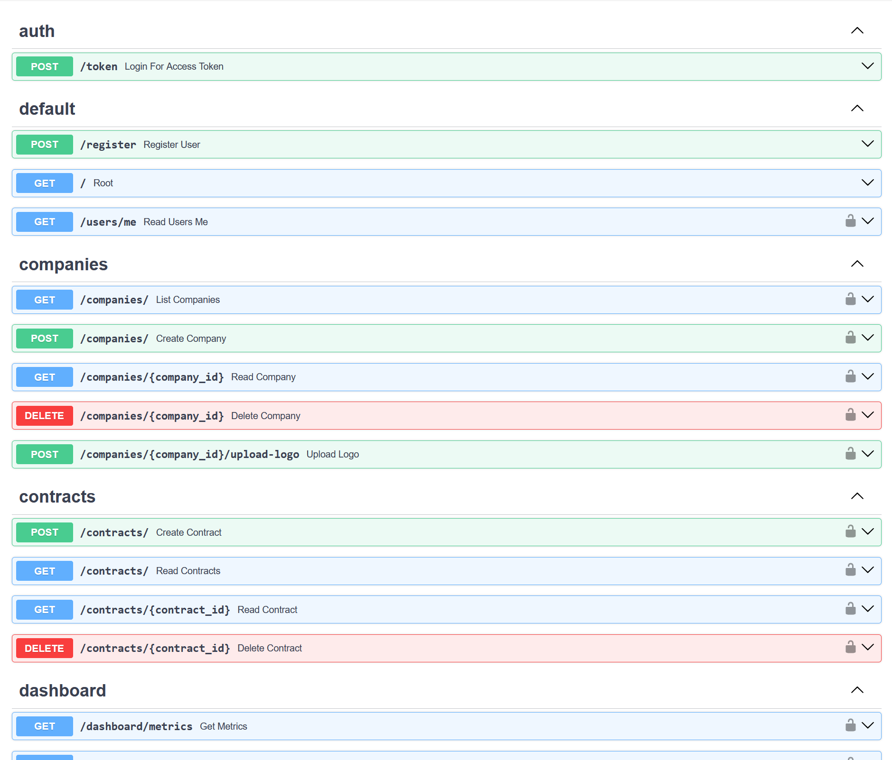
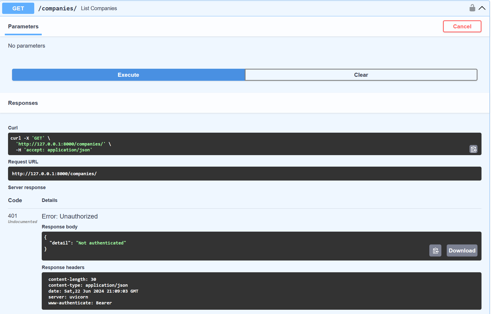
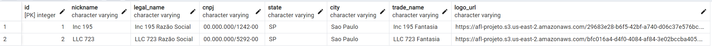
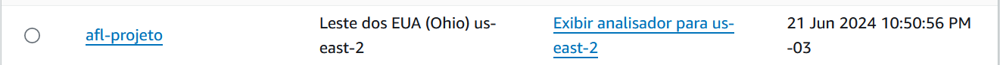
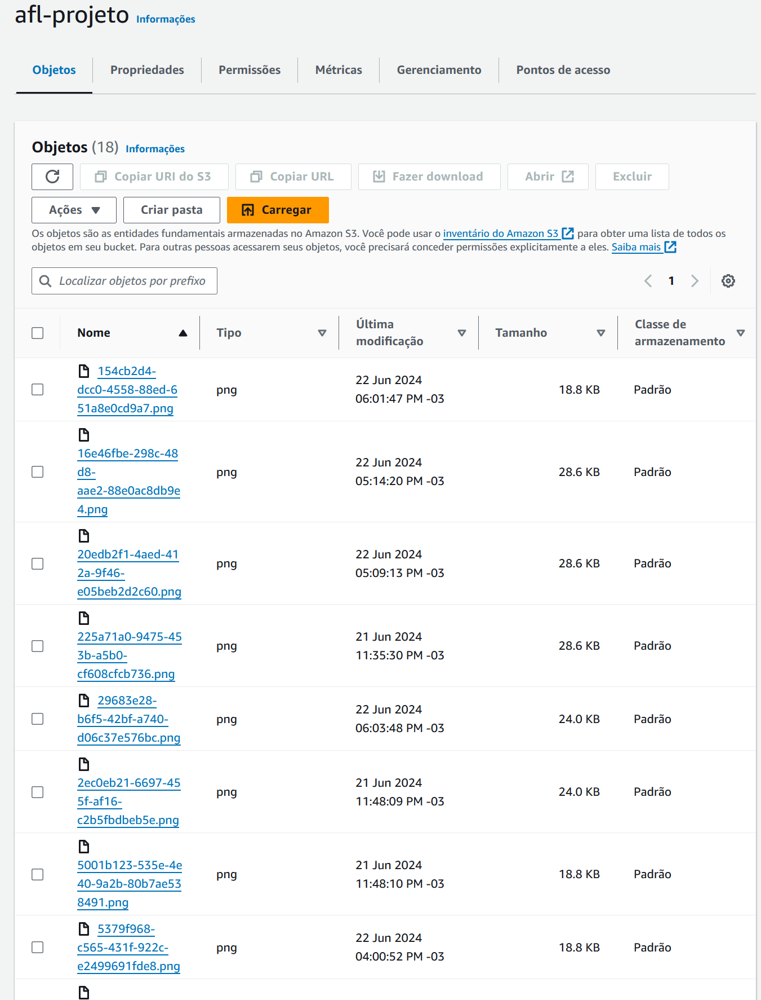
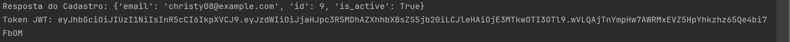
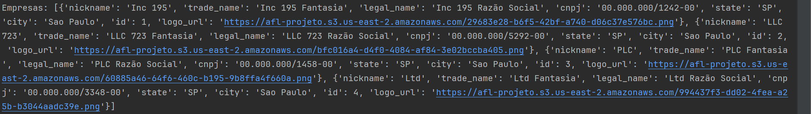
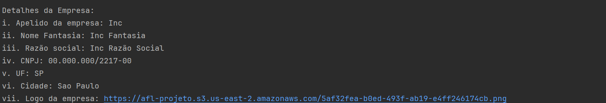
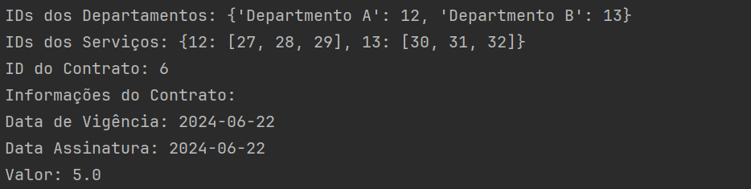
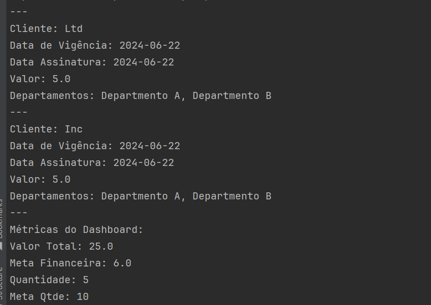

# Prova AFL

### O que é o projeto

Este projeto é uma API desenvolvida em FastAPI que gerencia empresas, contratos, departamentos e serviços. As informações são armazenadas em um banco de dados PostgreSQL e as logos das empresas são armazenadas em um bucket da AWS S3.

### Instalação

### Passo a passo para instalação

1. Clone este repositório:
    ```sh
    git clone https://github.com/leonardosblang/afl_prova
    cd afl_prova
    ```

2. Crie um ambiente virtual:
    ```sh
    python -m venv venv
    ```

3. Ative o ambiente virtual (é necessário rodar todos os scripts dentro da venv):

    - No Windows:
        ```sh
        venv\Scripts\activate
        ```
    - No MacOS/Linux:
        ```sh
        source venv/bin/activate
        ```

4. Instale as dependências:
    ```sh
    pip install -r requirements.txt
    ```

5. Preencha o arquivo `.env` com as informações necessárias, como as credenciais do banco de dados e da AWS.

### Executando a Aplicação

1. Para executar a aplicação:
    ```sh
    uvicorn app.main:app --reload
    ```

2. Acesse a documentação do FastAPI:
    
    Abra o navegador e acesse `http://127.0.0.1:8000/docs` para visualizar a documentação Swagger interativa.

3. Mostrando rota protegida implementada(é necessário o token de autenticação para ser autorizada a rota)
    

### Integração com PostgreSQL

Os dados são salvos em um banco de dados PostgreSQL.


### Integração com AWS S3

As imagens das logos das empresas são salvas em um bucket S3 da AWS e os links são armazenados no banco de dados.
 

### Exemplos com Figma

Há um script que valida o backend pra cada imagem do Figma (rode dentro da venv). Para rodar:
```sh
cd figma_examples
python figma_requests.py
```

#### Telas do Figma:
1. Login
    
2. Listagem de Empresas
    
3. Cadastro de Empresa
    
4. Contrato da Empresa
    
5. Dashboard e Métricas
    

### Teste de Endpoint /companies

Há um script adicional chamado `company_endpoint_test.py` que testa se uma empresa pode ter n contratos e também a exclusão de uma empresa e verifica se os contratos relacionados são também excluídos(está na mesma pasta que o anterior) (rode dentro da venv).
Para rodar:
```sh
python company_endpoint_test.py
```

### Testes Unitários

Os testes unitários para validar cada funcionalidade da aplicação estão localizados na pasta `tests` (rode dentro da venv). Para rodar os testes:
```sh
cd tests
python -m unittest discover
```
